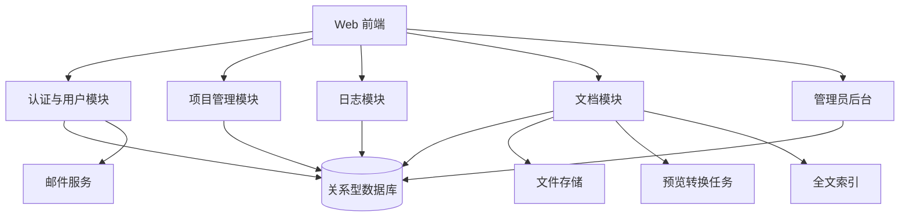

# 个人工作事务项目管理系统需求规格说明

## 文档信息
- 版本：v1.0
- 日期：2026-06-23
- 状态：初稿
- 来源：用户原始需求描述及上下文补充

## 1. 项目概述

### 1.1 项目背景
项目商务人员、项目负责人常常同时跟进多个项目。项目可能处于线索、售前、合同、执行、验收、暂停等不同状态，且每天产生的日志、文档、联系人、下一步节点容易散落在聊天、邮件、本地文件和个人记事中。

本系统用于个人工作事务管理和追踪，核心目标不是复杂的企业级项目协同，而是帮助个人快速看清“今天该做什么、每个项目目前到哪一步、哪些信息需要补齐”，并将项目过程中的文档、日志、里程碑、相关人统一沉淀。

### 1.2 项目目标
- 支持用户自助注册、邮箱验证码校验、防暴力注册。
- 支持普通用户登录后管理自己的项目、项目日志、项目文档、项目相关人、里程碑和下一步节点。
- 支持项目列表高密度展示，便于快速扫描多个项目状态。
- 支持项目名称、日志、文档内容或元数据的全文检索。
- 支持项目分类和状态自定义，分类可配置图标和颜色，状态支持多选。
- 支持项目文档按自定义多级目录归档，并提供常见办公文件、图片、音视频、压缩包预览或降级查看。
- 支持管理员管理所有用户、重置密码、查看用户项目数量和附件磁盘用量。

### 1.3 产品定位
- 面向个人使用，也可支持小团队内每人独立管理自己的项目。
- 权限模型采用“管理员全局管理 + 普通用户仅管理本人数据”。
- 初期优先 PC Web 端，页面清爽、文字紧凑、信息密度高，移动端提供基础可用的响应式访问。

### 1.4 术语表
| 术语 | 说明 |
|---|---|
| 项目 | 用户需要持续跟进的一项工作事务，可为工程实施、贸易交易、创新探讨、办公事务等 |
| 项目分类 | 用户自定义的项目类型，可设置名称、图标、颜色 |
| 项目状态 | 项目的当前业务阶段或标签，支持多选 |
| 里程碑 | 项目中的阶段性节点，可标记完成情况 |
| 下一步节点 | 项目最近一个需要跟进的动作或计划节点 |
| 项目日志 | 以日期为单位记录的项目进展，支持富文本编辑 |
| 项目文档 | 项目相关文件，可按多级目录管理 |
| 逻辑删除 | 数据标记为删除，不立即物理移除 |

## 2. 用户角色定义

| 角色 | 描述 | 权限 |
|---|---|---|
| 游客 | 未登录访问者 | 注册账号、登录、发送邮箱验证码 |
| 普通用户 | 已注册并通过验证的系统使用者 | 管理自己的项目、日志、文档、相关人、分类、状态模板、文件夹模板 |
| 管理员 | 系统内置或后台创建的 admin 账号 | 管理所有用户、新增/编辑用户、重置用户密码、查看用户用量、冻结或启用用户 |

## 3. 功能需求

### 3.1 账号注册与登录

#### 3.1.1 邮箱验证码注册
- 描述：用户通过邮箱、昵称、密码、验证码注册账号。
- 前置条件：邮箱未被注册，验证码在有效期内。
- 操作流程：
  1. 用户输入邮箱、昵称、密码。
  2. 用户点击“发送验证码”。
  3. 系统校验图片验证码或行为验证码，防止暴力发送。
  4. 系统向邮箱发送一次性验证码。
  5. 用户输入邮箱验证码并提交注册。
  6. 系统创建用户并跳转登录或自动登录。
- 预期结果：用户注册成功，可正常使用系统功能。
- 异常处理：
  - 邮箱已注册：提示“该邮箱已注册，可直接登录或找回密码”。
  - 验证码错误或过期：提示重新获取。
  - 发送过于频繁：限制重发并显示倒计时。

#### 3.1.2 登录与退出
- 描述：用户使用邮箱和密码登录。
- 操作流程：输入邮箱、密码，提交后进入项目列表首页。
- 预期结果：普通用户进入项目管理页，管理员可进入管理后台。
- 异常处理：密码错误、用户被冻结、账号不存在时显示明确提示。

#### 3.1.3 密码安全
- 描述：密码必须安全存储，管理员只能重置密码，不能查看原密码。
- 合理补充：支持后续扩展“忘记密码”邮箱重置流程。

### 3.2 用户首页与项目列表

#### 3.2.1 顶部导航
- 描述：登录后首先看到项目管理功能页。
- 页面结构：
  - 左侧：系统 Logo 和名称。
  - 右侧：用户头像、昵称、退出按钮。
  - 不展示其他顶层菜单，避免干扰项目列表。
- 合理性：该系统核心目标是个人项目追踪，首屏应直接进入工作台，而不是复杂导航。

#### 3.2.2 项目列表展示
- 描述：以表格方式展示用户项目。
- 字段：
  - 项目名称
  - 项目所属目录
  - 项目分类
  - 项目启动日期
  - 项目状态
  - 最后更新日期
  - 下一步项目节点
  - 总里程碑数量/已完成里程碑数量
  - 项目操作
- 项目操作：
  - 项目冻结
  - 项目启动
  - 项目基础信息编辑
  - 项目删除（逻辑删除）
- 交互要求：
  - 点击项目名称弹出项目详细面板。
  - 状态以多标签形式展示。
  - 里程碑完成度以文字和进度条同时展示。
  - 下一步节点突出展示日期和动作。

#### 3.2.3 分页与检索
- 描述：首页项目列表支持分页和检索。
- 分页：
  - 每页 10、20、50、100 条可选。
  - 支持上一页、下一页、页码跳转。
  - 每页条数选择控件放在分页控件后方，变更后立即刷新列表并回到第 1 页。
- 字段检索：
  - 支持所有列表字段筛选。
  - 检索条件区可分两行展示，避免单行过长影响可读性。
  - 检索条件变化后立即刷新列表结果，无需额外点击“查询”；文本关键词输入可采用短延迟自动刷新。
  - 支持按项目所属目录、分类、状态、启动日期、更新日期筛选。
  - 项目所属目录支持关键词检索，可按目录全路径或路径片段匹配，例如“重点客户”“2026实施”“办公事务”。
  - 项目分类支持多选，可同时筛选多个分类。
  - 项目状态支持多选，可同时筛选多个状态，匹配规则为项目拥有所选状态之一即命中；后续可扩展为“同时包含全部所选状态”。
  - 项目启动日期支持起止范围检索，允许只填开始日期或只填结束日期。
  - 最后更新日期支持起止范围检索，允许只填开始日期或只填结束日期。
- 全文检索：
  - 支持项目名称、项目日志、项目文档的全文检索。
  - 文档全文检索初期可优先支持 txt、markdown、docx、pdf、xlsx、pptx 的文本抽取，音视频仅检索文件名和描述。
- 列排序：
  - 项目大清单除“项目操作”列外，所有展示字段均支持排序。
  - 支持项目名称、项目所属目录、项目分类、项目启动日期、项目状态、最后更新日期、下一步项目节点日期、里程碑完成度排序。
  - 点击表头在升序和降序之间切换，并在表头显示当前排序方向。
  - 排序应与当前筛选、全文检索、分页条件共同生效；切换排序后默认回到第 1 页。
- 合理补充：全文检索结果需要标识命中来源，如“项目名称命中”“日志命中”“文档命中”。

### 3.3 项目基础信息管理

#### 3.3.1 新建项目
- 描述：用户创建项目并自动生成默认文档目录。
- 字段：
  - 项目名称（必填）
  - 项目所属目录（必填，可选择或输入）
  - 项目分类（必填）
  - 项目启动日期
  - 项目状态（多选）
  - 下一步项目节点
  - 项目说明
  - 相关人初始信息（可选）
- 默认文件夹模板：
  - 01.项目启动
  - 02.项目过程
  - 03.项目完结
- 合理补充：用户可在个人设置中维护默认文件夹模板，新项目创建时复制模板快照，后续模板修改不自动影响已创建项目。

#### 3.3.2 编辑项目
- 描述：修改项目基础信息、分类、状态、启动日期、下一步节点。
- 规则：
  - 已冻结项目默认不可编辑，需先启动/解冻。
  - 项目状态支持多选，允许“执行 + 紧急”等组合。

#### 3.3.3 冻结、启动、删除
- 冻结：项目保留但不可新增日志、文档和里程碑，可查看历史。
- 启动：从暂停、冻结等状态恢复为可编辑。
- 删除：逻辑删除，普通列表不再显示；初期可由管理员后台恢复，后续可提供回收站。

### 3.4 项目详情面板

#### 3.4.1 面板结构
- 描述：点击项目名称后弹出侧边或居中的项目详情面板。
- 顶部区域：
  - 项目名称
  - 分类图标与颜色
  - 多状态标签
  - 下一步节点
  - 里程碑完成进度
- 菜单：
  - 项目里程碑设计
  - 项目日志
  - 项目相关文档
  - 项目相关人
- 合理补充：采用右侧抽屉面板更适合高密度列表，不打断列表上下文。

### 3.5 项目里程碑设计

#### 3.5.1 里程碑管理
- 描述：为项目维护阶段节点。
- 字段：
  - 里程碑名称
  - 计划日期
  - 实际完成日期
  - 状态：未开始、进行中、已完成、延期
  - 负责人或相关人
  - 备注
- 操作：
  - 新增、编辑、删除、拖拽排序。
  - 标记完成。
- 列表展示：显示总数、已完成数、延期数和进度条。

### 3.6 项目日志

#### 3.6.1 日志日历
- 描述：日志以天为单位组织。
- 视图：
  - 周视图
  - 月视图
- 交互：
  - 选择某一天后进入该日富文本编辑。
  - 有日志的日期显示标记。
  - 支持快速查看最近更新日期。

#### 3.6.2 富文本编辑
- 描述：用户可在指定日期记录项目进展。
- 能力：
  - 标题、正文、加粗、列表、链接、引用。
  - 可插入文档引用或关联相关人。
  - 自动保存草稿。
- 合理补充：每个项目每天默认一篇日志，避免同一天多篇造成检索和回顾混乱；如需多段，可在同一日志中用小标题区分。

### 3.7 项目相关文档

#### 3.7.1 文档上传
- 描述：支持单个文件上传和文件夹批量上传。
- 支持格式：
  - Word：doc、docx
  - PDF：pdf
  - Excel：xls、xlsx、csv
  - PPT：ppt、pptx
  - 文本：txt、markdown、md
  - 图片：jpg、jpeg、png、gif、webp、bmp
  - 视频：mp4、mov、avi、mkv
  - 音频：mp3、wav、aac、m4a
  - 压缩包：zip、rar、7z
- 合理补充：
  - 浏览器无法直接预览的格式提供下载、元数据和转换状态。
  - 压缩包默认不在线解压预览，避免安全风险，先显示文件清单能力可作为后续增强。

#### 3.7.2 多级目录
- 描述：项目文档支持自定义多级目录。
- 初始目录：按用户模板生成。
- 操作：
  - 新建目录
  - 重命名目录
  - 移动文件
  - 删除文件或目录（逻辑删除或进入回收站）

#### 3.7.3 文档预览与全文索引
- 描述：常见文件支持预览。
- 初期策略：
  - PDF、图片、文本、Markdown：直接预览。
  - Office 文档：优先转换为 PDF 或 HTML 预览。
  - 音视频：使用浏览器播放器预览。
  - 压缩包：展示文件信息并下载。
- 全文索引：
  - 上传后异步抽取文本并建立索引。
  - 索引状态包括待处理、处理中、成功、失败。

### 3.8 项目相关人

#### 3.8.1 相关人管理
- 描述：记录项目中的联系人。
- 字段：
  - 姓名
  - 单位/部门
  - 角色
  - 手机
  - 邮箱
  - 微信或其他联系方式
  - 备注
- 合理补充：相关人归属于项目，不做全局通讯录；后续可扩展全局联系人复用。

### 3.9 分类、状态与模板配置

#### 3.9.1 项目分类配置
- 描述：用户可自定义项目分类。
- 默认分类：
  - 工程实施类
  - 贸易交易类
  - 创新探讨类
  - 办公事务类
- 字段：
  - 分类名称
  - 图标
  - 颜色
  - 排序
  - 是否启用

#### 3.9.2 项目状态配置
- 描述：状态支持多选。
- 默认状态：
  - 线索
  - 售前
  - 合同
  - 执行
  - 待验收
  - 暂停
  - 冻结
  - 完结
  - 紧急
- 合理补充：状态分为系统状态和业务状态。冻结、完结会影响操作权限；紧急、线索等仅作为业务标签。

#### 3.9.3 文件夹模板配置
- 描述：用户可配置新建项目时的默认文件夹模板。
- 默认模板：
  - 01.项目启动
  - 02.项目过程
  - 03.项目完结
- 支持多级目录，例如：
  - 01.项目启动/01.立项资料
  - 02.项目过程/01.会议纪要
  - 03.项目完结/01.验收资料

### 3.10 管理员后台

#### 3.10.1 用户管理
- 描述：admin 账号管理系统所有用户。
- 功能：
  - 新增用户
  - 编辑用户昵称、邮箱、状态、角色
  - 重置用户密码
  - 冻结或启用用户
  - 查看用户最近登录时间

#### 3.10.2 用户用量统计
- 描述：管理员查看每个用户的项目和附件用量。
- 指标：
  - 项目数量
  - 未删除项目数量
  - 附件文件数量
  - 项目附件占磁盘空间量
  - 最近更新时间
- 合理补充：磁盘用量以文件实际存储大小统计，保留逻辑删除文件时仍计入占用；物理清理后再释放。

## 4. 非功能需求

### 4.1 性能需求
- 项目列表常规查询响应时间：P95 小于 1 秒。
- 全文检索响应时间：普通用户万级文档内 P95 小于 2 秒。
- 文件上传支持断点或失败重试作为后续增强，初期单文件建议限制 200MB，可配置。
- 首页列表分页查询必须走分页，不一次性加载全部项目。

### 4.2 安全需求
- 密码使用强哈希算法存储，禁止明文保存。
- 邮箱验证码有效期建议 5 分钟。
- 验证码发送限制：
  - 同邮箱 60 秒内只能发送一次。
  - 同邮箱每天发送上限可配置。
  - 同 IP 短时间发送上限可配置。
- 普通用户只能访问本人项目、文档、日志和相关人。
- 管理后台仅管理员可访问。
- 文件上传必须校验扩展名、MIME、文件大小，并隔离存储。
- 在线预览应避免执行用户上传的脚本内容。
- 删除采用逻辑删除，重要操作记录审计日志。

### 4.3 可用性需求
- 页面清爽、紧凑，优先使用表格、标签、进度条、图标降低阅读成本。
- 常用操作不超过 2 次点击。
- 项目详情采用抽屉面板，避免频繁页面跳转。
- 关键操作提供确认弹窗和结果反馈。
- 富文本日志支持自动保存。

### 4.4 兼容性需求
- 首期支持现代桌面浏览器：Chrome、Edge、Safari、Firefox 最近两个大版本。
- 移动端适配基础查看和轻量编辑，不作为首期最佳体验目标。

### 4.5 可维护性需求
- 分类、状态、文件夹模板均应数据化配置。
- 文件预览、全文索引应模块化，便于后续更换实现。
- 附件存储路径不直接暴露真实服务器路径。

## 5. 数据需求

### 5.1 核心数据实体
| 实体 | 主要字段 |
|---|---|
| 用户 | 邮箱、昵称、密码哈希、头像、角色、状态、最近登录时间 |
| 邮箱验证码 | 邮箱、验证码哈希、用途、过期时间、使用状态、发送 IP |
| 项目 | 用户ID、名称、目录、分类ID、启动日期、下一步节点、说明、冻结状态、删除状态 |
| 项目分类 | 用户ID、名称、图标、颜色、排序、启用状态 |
| 项目状态 | 用户ID、名称、颜色、类型、排序、启用状态 |
| 项目状态关联 | 项目ID、状态ID |
| 里程碑 | 项目ID、名称、计划日期、完成日期、状态、排序、备注 |
| 项目日志 | 项目ID、日志日期、标题、富文本内容、纯文本内容、更新时间 |
| 文档目录 | 项目ID、父目录ID、名称、排序 |
| 项目文档 | 项目ID、目录ID、文件名、文件类型、大小、存储路径、索引状态、删除状态 |
| 相关人 | 项目ID、姓名、单位、角色、联系方式、备注 |
| 文件夹模板 | 用户ID、模板名称、目录树 JSON、是否默认 |
| 审计日志 | 操作人、对象类型、对象ID、动作、时间、IP |

### 5.2 数据关系
- 一个用户拥有多个项目。
- 一个用户拥有自己的分类、状态、文件夹模板。
- 一个项目属于一个分类，可关联多个状态。
- 一个项目拥有多个里程碑、日志、文档目录、文档和相关人。
- 一个文档目录可多级嵌套。
- 管理员可读取所有用户及其统计信息，但不应直接读取用户密码。

### 5.3 数据量预估
- 单用户项目数：常规 100-1000。
- 单项目文档数：常规 10-500。
- 单用户附件容量：初期建议默认限制 5GB，可由管理员配置。
- 日志数量：按项目每日一篇，长期可达数万篇，需建立索引。

## 6. 业务规则

### 6.1 状态多选规则
- 一个项目可同时拥有多个业务状态。
- 冻结、完结属于操作影响状态：
  - 冻结项目禁止新增或修改日志、文档、里程碑。
  - 完结项目默认只读，可允许用户重新启动。
- 紧急可与任何状态共存。

### 6.2 项目删除规则
- 普通删除为逻辑删除。
- 逻辑删除后不在普通列表出现，不参与默认检索。
- 附件物理文件暂不删除，仍计入磁盘占用。

### 6.3 文档预览规则
- 可安全直接预览的文件优先直接预览。
- 需要转换的文件异步生成预览文件。
- 转换失败时允许下载原文件并展示失败原因。

### 6.4 全文检索规则
- 检索范围默认包括当前用户未删除项目。
- 检索对象包括项目名称、项目说明、日志纯文本、文档抽取文本、文档文件名。
- 检索结果必须标明命中对象和所属项目。

### 6.5 验证码规则
- 邮箱验证码仅可使用一次。
- 过期、已使用、超过重试次数均不可再用。
- 发送和验证过程记录风控信息。

## 7. 接口需求

### 7.1 邮件发送服务
- 用途：发送注册验证码、后续密码找回验证码。
- 方向：出站。
- 数据格式：邮箱地址、验证码、模板变量。
- 约束：邮件发送失败需提示用户稍后重试，并记录失败原因。

### 7.2 文件预览与全文索引服务
- 用途：将上传文件转换为可预览内容并抽取文本。
- 方向：内部服务。
- 数据格式：文件路径、文件类型、任务状态、抽取文本。
- 约束：失败不影响原文件保存。

## 8. 需求优先级

| 需求 | 优先级 | 说明 |
|---|---|---|
| 邮箱注册、验证码、登录、退出 | P0 | 使用系统的基础能力 |
| 普通用户项目列表、分页、筛选 | P0 | 首页核心 |
| 新建、编辑、冻结、启动、逻辑删除项目 | P0 | 项目生命周期核心 |
| 项目详情面板 | P0 | 承载里程碑、日志、文档、相关人 |
| 项目日志日/周/月视图与富文本编辑 | P0 | 日常追踪核心 |
| 文档上传、多级目录、基础预览 | P0 | 项目信息沉淀核心 |
| 分类、状态自定义 | P1 | 提升个人化管理能力 |
| 全文检索 | P1 | 文档和日志积累后的关键效率功能 |
| 管理员用户管理与用量统计 | P1 | 系统管理必要能力 |
| 文件夹模板自定义 | P1 | 提升新建项目效率 |
| 音视频在线播放、Office 高保真预览 | P2 | 体验增强，可分阶段实现 |
| 回收站、附件物理清理策略 | P2 | 数据治理增强 |

## 9. 约束与假设

### 9.1 技术约束
- 初期按 Web 系统设计，前后端可分离或服务端渲染均可。
- 文件存储可先使用本地磁盘，后续可切换对象存储。
- 全文检索可先使用数据库全文索引或轻量搜索引擎，数据量扩大后再升级。

### 9.2 业务约束
- 普通用户之间数据隔离。
- 管理员账号应初始化创建，避免开放注册为管理员。
- 项目状态多选可能导致含义混乱，因此需要区分业务标签和系统控制状态。

### 9.3 合理假设
- 系统首先面向个人工作事务管理，不做复杂团队协作、审批流和任务派发。
- 项目相关人仅作为联系人记录，不具备登录系统或协同编辑权限。
- 日志按“项目 + 日期”唯一，便于日历展示和检索。
- 文档目录模板在新建项目时复制，保证历史项目目录结构稳定。

## 附录 A. 用户故事列表
- 作为游客，我希望通过邮箱验证码注册账号，以便开始使用系统。
- 作为普通用户，我希望登录后直接看到项目列表，以便快速判断今天应该处理哪些项目。
- 作为普通用户，我希望项目状态可以多选，以便表达“执行中且紧急”这类真实情况。
- 作为普通用户，我希望点击项目名称即可查看详情，以便不离开列表上下文。
- 作为普通用户，我希望每天为项目写日志，以便回顾项目推进过程。
- 作为普通用户，我希望上传项目文档并按目录归档，以便集中管理资料。
- 作为普通用户，我希望全文检索项目、日志和文档，以便快速找回历史信息。
- 作为管理员，我希望查看每个用户项目数和附件占用，以便管理系统资源。
- 作为管理员，我希望重置用户密码，以便处理用户无法登录的问题。

## 附录 B. 用例图（文字描述）
- 游客：注册、发送验证码、登录。
- 普通用户：管理项目、管理里程碑、写项目日志、管理文档、管理相关人、配置分类状态模板。
- 管理员：管理用户、重置密码、查看用量、冻结用户。

## 附录 C. 系统结构图

